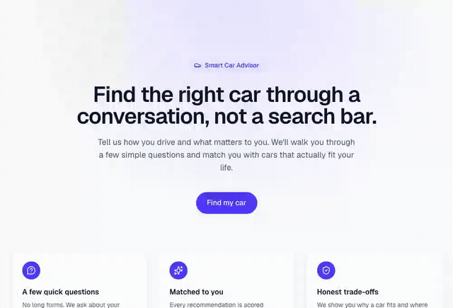

# Smart Car Advisor

A conversational car-buying advisor. Instead of a filter-heavy search page, users
answer a short guided questionnaire about their budget, driving habits, and
priorities — and get back a ranked shortlist of real cars with a transparent,
data-backed explanation of *why* each one fits.



## What it does

1. A user walks through 8 quick questions (budget, daily driving distance,
   city/highway usage, family size, fuel/transmission/body-type preferences, and
   what matters most to them).
2. The backend scores every matching car variant in the catalog against those
   answers — not a generic "top 10 cars" list.
3. The top 5 results come back with an overall score, a confidence rating, plain-
   language reasons the car fits, honest trade-offs, standout features, and real
   review snippets.

## Architecture

Monorepo with two apps and one database:

```
smart-car-advisor/
├── apps/
│   ├── api/   # FastAPI backend
│   └── web/   # Next.js frontend
└── PostgreSQL # car catalog: makers, models, variants, specs, features, reviews
```

The backend follows a strict layered architecture — every request flows through
the same chain, with each layer responsible for exactly one thing:

```
Route → Controller → Service → Repository → Database
 (path/     (request/    (business    (SQL/ORM
  method)    response)    logic)       queries)
```

- **`routes/`** — declares endpoints only (path, method, DI wiring)
- **`controllers/`** — shapes requests/responses, no business logic
- **`services/`** — all business logic, including the recommendation engine
- **`repositories/`** — the only layer that touches the database
- **`models/` / `schemas/`** — SQLAlchemy ORM models and Pydantic
  validation schemas, kept strictly separate

Every response — success or error — is wrapped in the same envelope
(`{ success, message, data, error }`), so the frontend only ever needs to branch
on one boolean. Full conventions are documented in [`CLAUDE.md`](CLAUDE.md).

The frontend is a guided, single-purpose flow: **Landing → Questionnaire →
Recommendations**, calling the one backend endpoint below and rendering full
detail inline (no separate details/compare pages yet).

## The Recommendation Engine

`POST /api/v1/car-recommendations` — the core of the app.

1. **Hard filters** narrow the catalog to real candidates: budget (with a small
   grace window), and any explicit fuel/transmission/body-type preference. If
   that's too strict and turns up nothing, a **relaxation ladder** progressively
   drops constraints (body type → wider budget → transmission → fuel) until
   enough candidates are found.
2. **Six weighted dimensions** score every remaining candidate: Price/Value, Fuel
   Efficiency, Performance, Safety, Comfort & Features, and Reliability (from
   real review ratings). Base weights shift based on what the user actually said
   — selecting "Safety" as a priority, driving mostly on the highway, a long
   daily commute, or a large family all rebalance the weights differently.
3. **Family size** is never a hard filter — a 7-seat requirement doesn't zero out
   the results — but it heavily biases the Comfort dimension toward cars with
   adequate seating and boot space, and a seating shortfall is always disclosed
   honestly rather than hidden in a blended score.
4. **Confidence and explanations** are computed from the same scores: how large
   the gap is to the next-best car, how many candidates were even available, and
   how complete the underlying data is. Match reasons, trade-offs, and feature
   highlights are all **rule-based templates over real numbers** — never an LLM
   call — so every claim is traceable back to actual data.
5. The **top 5** are returned, ranked, each with its full explanation.

See [`car_recommendation_service.py`](apps/api/src/app/services/car_recommendation_service.py),
[`car_recommendation_scoring.py`](apps/api/src/app/services/car_recommendation_scoring.py), and
[`car_recommendation_explanations.py`](apps/api/src/app/services/car_recommendation_explanations.py)
for the full implementation.

## Tech Stack

| | |
|---|---|
| **Backend** | Python 3.12, FastAPI, SQLAlchemy 2.0, PostgreSQL, Alembic, Pydantic, uv, pytest, ruff |
| **Frontend** | Next.js 16 (App Router), React 19, TypeScript, Tailwind CSS v4 |
| **Database** | PostgreSQL — ~130 real Indian-market car models seeded with realistic prices, specs, features, and reviews |

## Local Setup

**Prerequisites:** Python 3.12+, [uv](https://docs.astral.sh/uv/), Node.js 20+,
PostgreSQL 14+.

### 1. Database

```bash
createdb smart_car_advisor
```

### 2. Backend

```bash
cd apps/api
uv sync
cp .env.example .env          # edit DATABASE_URL if needed
uv run alembic upgrade head    # create schema
uv run python -m app.seed.run_seed   # populate ~130 cars (safe to re-run)
uv run uvicorn app.main:app --reload --port 8000
```

API is now live at `http://localhost:8000` (interactive docs at `/docs`).

### 3. Frontend

```bash
cd apps/web
npm install
cp .env.local.example .env.local
npm run dev
```

Open `http://localhost:3000` and click through the flow.

### Running tests

```bash
cd apps/api && uv run pytest
```

## Project Status

See [`PROGRESS.md`](PROGRESS.md) for what's built, what's decided, and what's next.
